# IDAO-21 Baseline

## Problem description

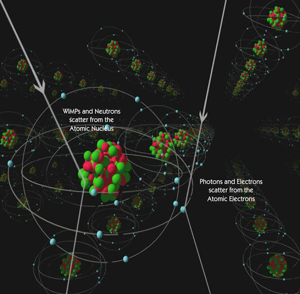

The presence of Dark Matter (DM) in the Universe is nowadays an established, yet still mysterious, paradigm: deciphering its essence is one of the most compelling tasks for fundamental physics today. The nature of DM represents one of the key issues to understanding our Universe. Different models predict the existence of neutral particles with a mass of few GeV or higher that would fill our Galaxy. They could interact with the nuclei present in ordinary matter producing highly ionizing nuclear recoils (NR) with a kinetic energy as small as few keV. These NR would travel for hundreds to thousands of microns in gas leaving a trail of ionized atoms and free electrons.

Several experiments have been studied to detect those trails and possibly to reconstruct their main properties as position, direction, total amount of produced ionization. CYGNO collaboration is developing a technology able to collect those electrons on a structure where they produce photons, so that to have the possibility of creating images representing the 2D projection of the 3D NR trajectories.

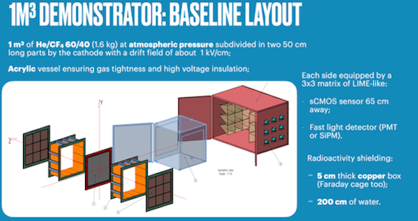

Low energy photons produced by natural radioactivity can ionize electrons from atoms and molecules in the detector, producing recoils that would represent an important and dangerous background to Dark Matter signals. Electron recoils (ER) will produce distinctive and diverse patterns of ionization charge and therefore different images, given the different way they deposit energy and interact with matter.

Thus, NR and ER can be efficiently identified and separated down to low kinetic energies by studying the properties of the particle tracks.

In all cases, while traveling in gas, ionised electrons will be subject to diffusion effects that blur final images. Moreover, optical sensors used to collect the photons have a small, yet not negligible, electronic noise that adds up to physical signals.

In this competition we propose you images taken from 12 classes (6 classes of ER and 6 of NR) obtained by simulating detector response to ER and NR events with different energies.

The test asks to properly assign each image to the correct particle type (ER/NR) and reconstruct the particle angle.

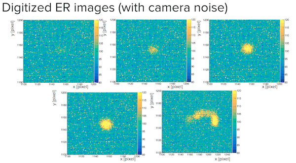
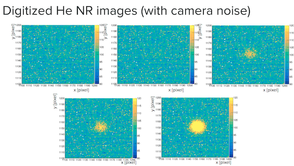
## Dataset
Dataset is available for download through Yandex disk -> [Click here](https://yadi.sk/d/UJ8DEma9LHRMsg).

Each directory contain images in `.png` format, the filename contain the
class label information.
```
_dataset/
├── private_test
│   └── *.png
├── publis_test
│   └── *.png
└── train
    ├── ER
    └── NR

```
Each directory contain bunch of images the image name contain the class label and other informaion.
The most important part is the class label which is in {1.0, 3.0, 6.0, 10.0, 20.0, 30.0} and has `_keV` suffix.

```
0.00012752991074573__CYGNO_60_40_ER_30_keV_930V_30cm_IDAO_iso_crop_hist_pic_run4_ev846;1.png
0.0001805024851534__CYGNO_60_40_ER_10_keV_930V_30cm_IDAO_iso_crop_hist_pic_run2_ev317;1.png
0.00013557143164375__CYGNO_60_40_ER_10_keV_930V_30cm_IDAO_iso_crop_hist_pic_run2_ev842;1.png
0.00019057084775703__CYGNO_60_40_ER_3_keV_930V_30cm_IDAO_iso_crop_hist_pic_run2_ev116;1.png
0.0001135022106767__CYGNO_60_40_ER_10_keV_930V_30cm_IDAO_iso_crop_hist_pic_run5_ev136;1.png
0.0001275016178883__CYGNO_60_40_ER_3_keV_930V_30cm_IDAO_iso_crop_hist_pic_run2_ev485;1.png
0.0001375808674508__CYGNO_60_40_ER_30_keV_930V_30cm_IDAO_iso_crop_hist_pic_run3_ev662;1.png
0.0011665058173393__CYGNO_60_40_ER_10_keV_930V_30cm_IDAO_iso_crop_hist_pic_run5_ev574;1.png
0.0011465791675372__CYGNO_60_40_ER_3_keV_930V_30cm_IDAO_iso_crop_hist_pic_run2_ev114;1.png
0.0011065850424555__CYGNO_60_40_ER_3_keV_930V_30cm_IDAO_iso_crop_hist_pic_run4_ev868;1.png
```
#### Data spliting
The total number of samples in the dataset is ~30k sample distributed with 2 classes ER=0 and NR=1.
The dataset are interleaved in the following scheme:
##### Interleave the files
|Energy| He   | e |
| ---  | ---- |---|
| 1    |  *   | - |
| 3    |  -   | * |
| 6    |  *   | - |
| 10   |  -   | * |
| 20   |  *   | - |
| 30   |  -   | * |
* is training; - is testing


### Dataset distribution

The training sample contains **2200** examples of each training class and 2 examples each test class. The energies and particle types for the training dataset are known.

The public test sample contains **250** examples of each of the training classes.

The private test sample contains the **2500** examples from each testing class.

## Training
If you want to retrain the model just run:
```
mv checkpoints checkpoints_bk && python train.py
```
This will move the original checkpoints and run the experiment again.
Note you can modify `config.ini` to loader the checkpoint without moving the files.

## Results 
To generate the report just run:
```
python report.py
```
This will generate `./resultsreport.log` in the current directory containg information and bunch of plots in the `./results/` directory

### Score
Score = MAE - AUC

MAE is the mean absolute error (L1) of the predicted energy.

AUC is the ROC AUC of the classification problem.

Please upload your predictions into the system in the .csv format. The file should consist of 16564 rows and contain three columns:
id, classification_predictions, regression_predictions


---
### Classification
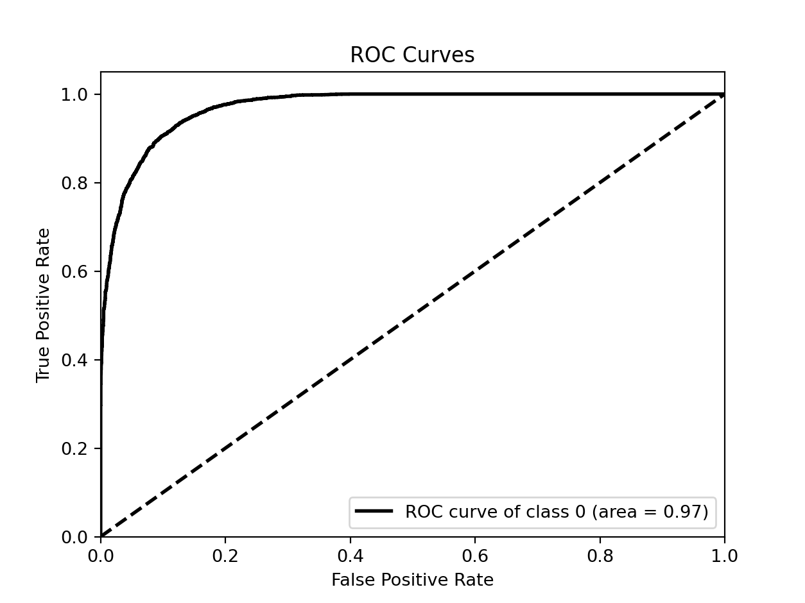
---
### Regression
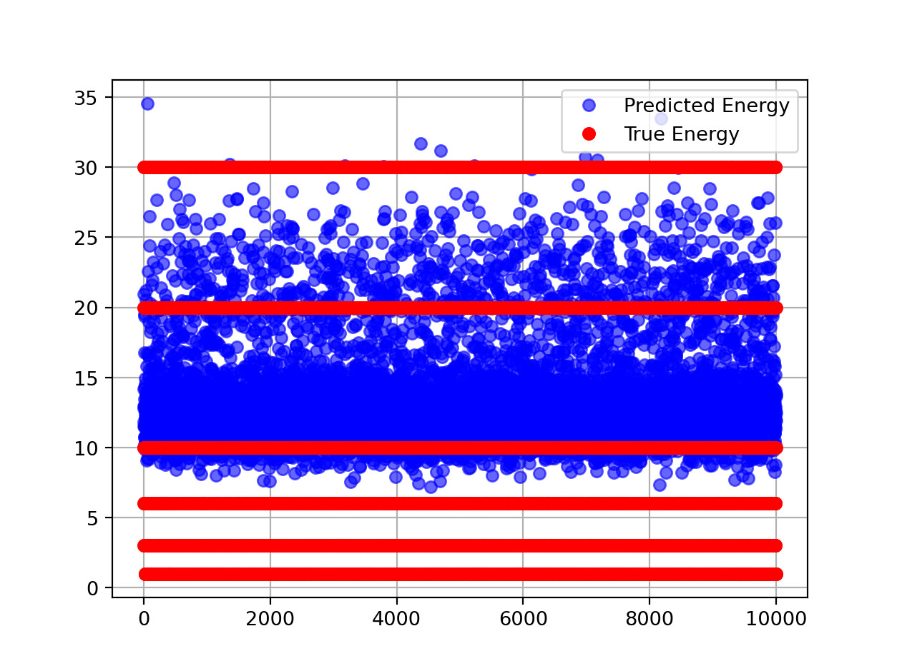
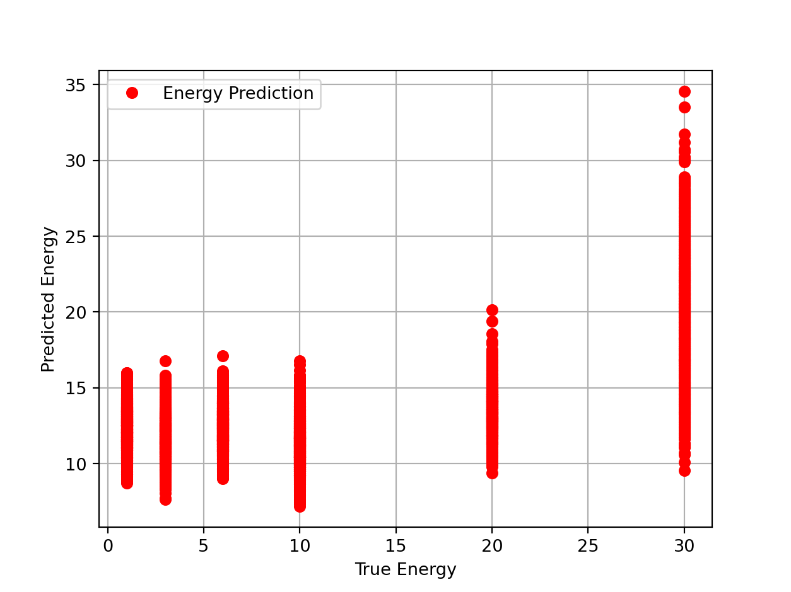
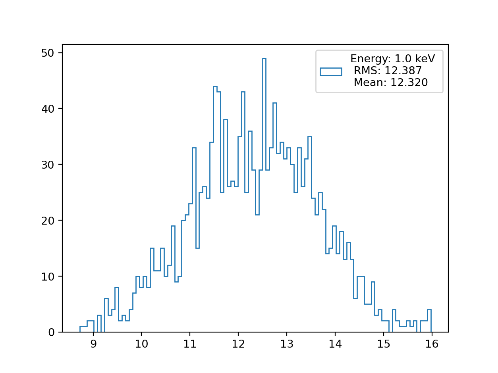
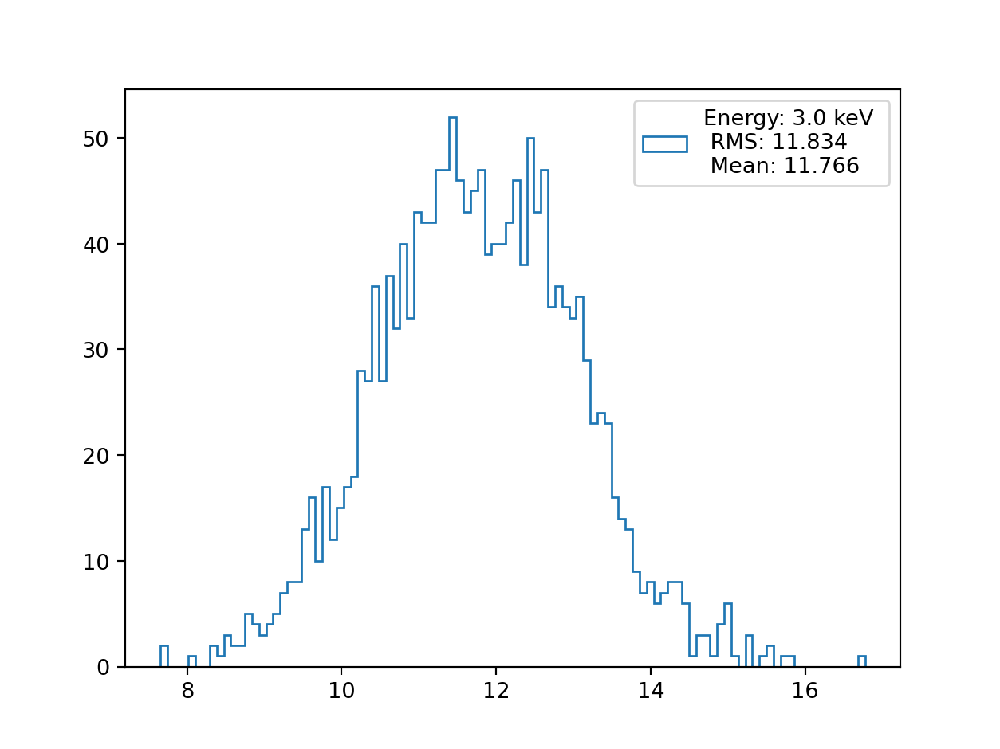
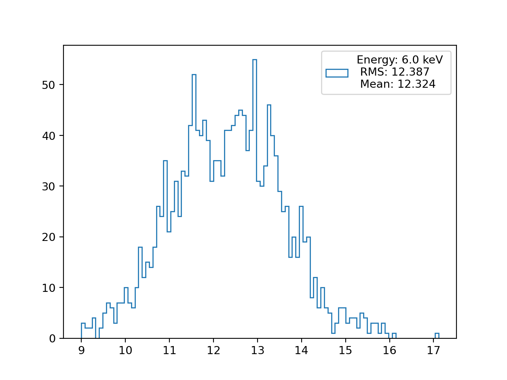
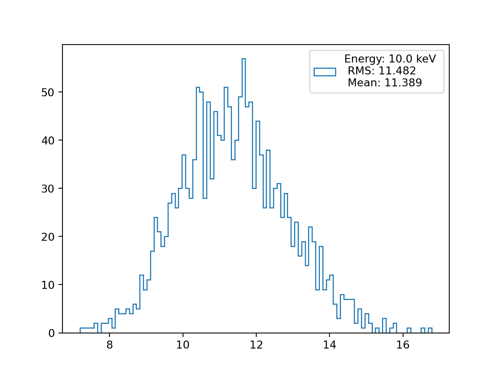
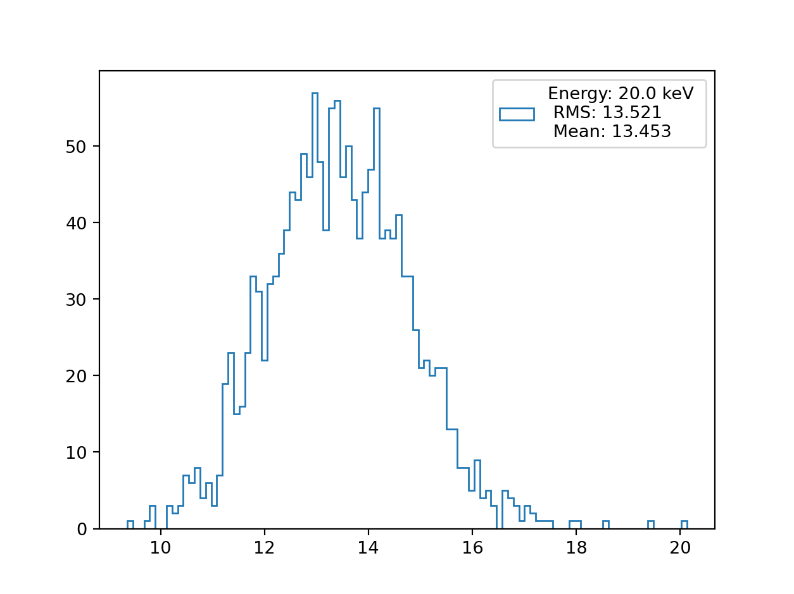
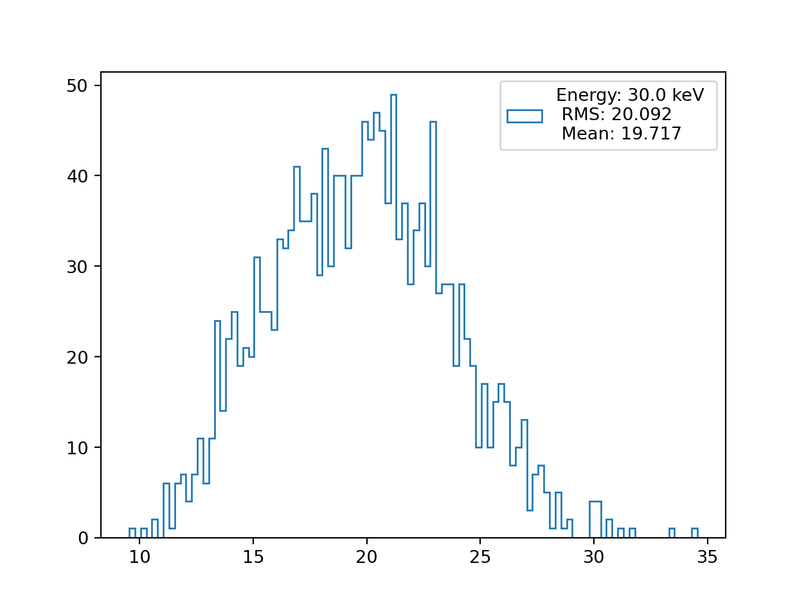

# Submission
To generate `submission.csv` run:
```
python generate_submission.py
```

